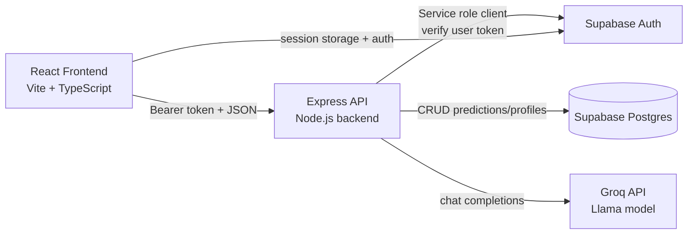

# HypoShield AI

HypoShield AI is a full-stack diabetes support platform focused on early hypoglycemia risk awareness. It combines user-entered health context (glucose, insulin timing, meals, and activity), a deterministic risk engine, historical tracking, and LLM-powered explanation generation to provide understandable and actionable risk guidance.

This repository contains:

- A React + TypeScript frontend (Vite)
- A Node.js + Express backend API
- Supabase Auth + PostgreSQL (with RLS)
- Groq LLM integration for explanation generation

## 1. Project Overview

People living with diabetes often need to estimate low-blood-sugar risk using multiple factors at once. HypoShield AI helps by structuring those factors into a consistent risk score and translating the result into plain-language guidance.

The project solves:

- Fragmented decision-making around glucose, insulin, food, and activity
- Lack of explainability in risk outputs
- Limited continuity between one-off inputs and historical patterns

Primary outcomes:

- Risk classification (`LOW`, `MEDIUM`, `HIGH`)
- 30/60/90-minute projected risk/glucose snapshots
- AI-generated explanation text based on prediction factors
- Persisted prediction history per authenticated user

## 2. Core Features

### User Authentication

- Email/password sign-up and sign-in via Supabase Auth
- Google OAuth sign-in via Lovable cloud auth helper + Supabase session set
- Session-aware protected routes in the frontend
- Sign-out support in desktop and mobile navigation

### Onboarding Flow

- 6-stage onboarding wizard:
  - Basic profile
  - Diabetes profile
  - Monitoring preferences
  - Lifestyle
  - Hypo risk preferences
  - Optional medical context
- On completion, onboarding data is sent to backend and upserted into `profiles`
- Route guard forces onboarding before accessing core app pages

### Profile Management

- Profile page reads full user profile from Supabase
- Edit mode updates onboarding-derived profile fields
- Supports insulin schedule, monitoring mode, hypo timing, and optional summaries

### Health Data Input

- Predict page accepts:
  - Glucose value + source (`cgm` or `glucometer`)
  - Insulin dose/type/time
  - Meal recency
  - Activity type/duration
- Input is validated in frontend and backend (Zod on backend)

### Hypoglycemia Risk Prediction

- Deterministic factor-based scoring engine includes:
  - Glucose factor
  - Insulin factor
  - Meal-gap factor
  - Activity factor
  - Trend factor
  - Time-of-day factor
- Produces:
  - `riskScore`
  - `riskLevel`
  - `confidence`
  - 30/60/90 min projections
  - baseline explanation + recommended actions

### AI Insights Generation

- Insights page loads user predictions and lets users generate explanation text via backend LLM endpoint
- Supports re-generation for currently selected prediction
- Handles loading, error, and success states in UI

### Dashboard Visualization

- Risk summary cards
- 6-hour glucose trend chart
- Risk factor breakdown chart
- Prediction timeline and recommended actions
- Falls back gracefully when no recent history exists

### Risk Level Indicator

- Consistent visual semantics (`LOW`, `MEDIUM`, `HIGH`) across Dashboard/History/Predict
- Risk score thresholds:
  - `>= 9`: `HIGH`
  - `>= 5`: `MEDIUM`
  - `< 5`: `LOW`

### CGM Data Analysis

- Input model supports CGM context (`glucoseSource: cgm`) and optional readings for trend analysis
- Backend schema supports `readings[]` with value/minutesAgo/source

### Manual Glucose Input Analysis

- Full support for glucometer/manual glucose input
- Manual mode influences confidence range and prediction behavior

### No-Daily-Sampling Prediction Mode

- `lifestyle` mode is supported when glucose is not provided
- Allows risk estimation based on non-glucose lifestyle/behavioral factors

### Historical Health Data Tracking

- All predictions are persisted in `predictions` table by user
- History page lists prior risk entries with date/risk/explanation
- Dashboard uses historical records for trend rendering

## 3. System Architecture



### Frontend Architecture

- SPA with React Router and protected route wrapper
- Global auth state in `AuthContext`
- API client abstraction (`src/lib/api.ts`) that auto-attaches bearer token
- UI components are Tailwind + shadcn-style primitives + custom glassmorphism components

### Backend Architecture

- Single Express app (`backend/server.js`)
- Route-level auth middleware (`requireAuth`) uses Supabase `auth.getUser(token)`
- Input validation with Zod
- Built-in middleware stack:
  - CORS policy
  - JSON parsing
  - Global + endpoint-specific rate limits

### API Layer

- REST endpoints under `/api/*`
- Consistent JSON response contract for success/error
- Endpoint protection by bearer token for predictions/onboarding/insights

### AI Inference Layer

- Backend `POST /api/insights/explain` transforms prediction factors into a structured prompt
- Calls Groq OpenAI-compatible chat completion endpoint
- Returns explanation-only payload to frontend

### Database Layer

- Supabase PostgreSQL
- Core tables: `profiles`, `predictions`
- Trigger for auto profile row creation on new auth user
- RLS policies for per-user data isolation

### Authentication Flow

1. User signs up/signs in in frontend (Supabase Auth)
2. Supabase session token stored client-side
3. Frontend API client fetches session token and attaches `Authorization: Bearer <token>`
4. Backend verifies token via Supabase before protected endpoint logic
5. Backend resolves `req.user.id` from verified token and scopes DB actions accordingly

## 4. Tech Stack

### Frontend

- React 18
- Vite 5
- TypeScript
- Tailwind CSS
- shadcn-compatible UI primitives (Radix-based components)
- Framer Motion
- Recharts
- React Router
- React Hook Form

### Backend

- Node.js (ESM)
- Express 4
- Zod
- CORS
- express-rate-limit

### Database

- Supabase PostgreSQL
- SQL migrations in `supabase/migrations`

### AI / LLM

- Groq API (`/openai/v1/chat/completions`)
- Current configured model: `llama-3.1-8b-instant`

### Authentication

- Supabase Auth (email/password)
- Google OAuth via `@lovable.dev/cloud-auth-js` integration

### Tooling / Quality

- ESLint 9
- Vitest
- Playwright config scaffold

## 5. Project Folder Structure

```text
hypo-shield-ai-main/
  backend/
    server.js                # Express app, auth middleware, prediction/onboarding endpoints
    env-config.js            # Environment loading + validation
    cors-config.js           # CORS allowlist policy
    rate-limit.js            # Global and route-specific rate limiting
    routes/
      insights.js            # Groq explanation endpoint
    data/
      predictions.json       # Local sample/legacy data artifact

  src/
    App.tsx                  # Router + providers
    main.tsx                 # App bootstrap
    index.css                # Theme, tokens, utility classes

    contexts/
      AuthContext.tsx        # Session state, onboarding status, sign-out

    components/
      Navbar.tsx             # Main navigation + sign out
      ProtectedRoute.tsx     # Auth + onboarding route guard
      onboarding/            # Multi-step onboarding/edit forms
      ui/                    # shadcn-style reusable UI primitives

    pages/
      Landing.tsx            # Marketing/entry page
      Login.tsx              # Email/password + Google auth
      Register.tsx           # User registration
      Onboarding.tsx         # 6-step profile completion flow
      Dashboard.tsx          # Risk overview + charts
      Predict.tsx            # Data entry + prediction request
      Insights.tsx           # LLM explanations for selected predictions
      History.tsx            # Historical risk log
      Profile.tsx            # Profile viewing/editing

    lib/
      api.ts                 # Authenticated API client
      risk-engine.ts         # Frontend risk calculation helpers/types

    integrations/
      supabase/              # Supabase client + generated DB types
      lovable/               # OAuth helper adapter

  supabase/
    config.toml
    migrations/
      001_initial_schema.sql
      002_add_onboarding_fields.sql

  vite.config.ts
  vitest.config.ts
  playwright.config.ts
  tailwind.config.ts
  eslint.config.js
```

## 6. Database Schema

> Source: `supabase/migrations/001_initial_schema.sql` and `002_add_onboarding_fields.sql`

### Table: `public.profiles`

Primary relationship:

- `id uuid primary key` references `auth.users(id)` (1:1 with auth user)

Core columns:

- `id uuid`
- `full_name text`
- `age integer`
- `gender text`
- `weight numeric(6,1)`
- `diabetes_type text`
- `diagnosis_date date`
- `years_since_diagnosis integer`
- `insulin_usage boolean`
- `insulin_type text`
- `insulin_dosage_range text`
- `insulin_schedule text[]`
- `monitoring_mode text`
- `cgm_brand text`
- `reading_frequency text`
- `meal_times jsonb`
- `skip_meals boolean`
- `diet_type text`
- `activity_level text`
- `exercise_frequency text`
- `sleep_start_time text`
- `sleep_end_time text`
- `hypo_frequency text`
- `hypo_timing text[]`
- `alert_preference text`
- `medical_summary text`
- `prescription_summary text`
- `hba1c numeric(4,1)`
- `insulin_regimen text`
- `last_glucose numeric(6,1)`
- `risk_today text`
- `onboarding_completed boolean default false`
- `created_at timestamptz`
- `updated_at timestamptz`

Constraints and helpers:

- Check constraints for age/HbA1c/glucose ranges and categorical values
- `set_updated_at` trigger updates `updated_at` on row update
- `handle_new_user` trigger creates a profile row when a new auth user is created

RLS policies:

- Users can select/insert/update only their own profile (`auth.uid() = id`)

### Table: `public.predictions`

Relationships:

- `user_id uuid` references `auth.users(id)` (many predictions per user)

Columns:

- `id uuid primary key`
- `user_id uuid not null`
- `input jsonb not null`
- `result jsonb not null`
- `created_at timestamptz not null default now()`

RLS policies:

- Select/insert/delete only rows where `auth.uid() = user_id`

Indexes:

- `predictions_user_id_created_at_idx (user_id, created_at desc)`

## 7. API Documentation

Base URL (local):

- Backend: `http://localhost:4000`
- Frontend (Vite dev): `http://localhost:8080` with `/api` proxy to backend

### Health Check

- **Endpoint:** `/api/health`
- **Method:** `GET`
- **Auth:** Not required
- **Purpose:** Liveness and basic backend status

Response:

```json
{
  "status": "ok",
  "now": "2026-04-06T00:00:00.000Z",
  "supabaseEnabled": true
}
```

### List Predictions

- **Endpoint:** `/api/predictions`
- **Method:** `GET`
- **Auth:** Required (`Bearer`)
- **Query:** `limit` (optional, 1-100, default 20)
- **Purpose:** Fetch recent user predictions

Response:

```json
{
  "data": [
    {
      "id": "uuid",
      "userId": "uuid",
      "input": {},
      "result": {},
      "createdAt": "ISO date"
    }
  ]
}
```

### Create Prediction

- **Endpoint:** `/api/predictions`
- **Method:** `POST`
- **Auth:** Required (`Bearer`)
- **Rate limit:** 20 requests / 10 minutes (plus global limiter)
- **Purpose:** Validate input, compute risk, persist prediction

Request body (shape):

```json
{
  "mode": "cgm | manual | lifestyle",
  "glucose": 92,
  "glucoseSource": "cgm | glucometer",
  "insulin": {
    "dosage": 4,
    "type": "rapid-acting | long-acting",
    "hoursAgo": 2
  },
  "mealHoursAgo": 4,
  "activity": {
    "type": "walking",
    "duration": 20,
    "hoursAgo": 1
  },
  "readings": [
    {
      "value": 95,
      "minutesAgo": 30,
      "source": "cgm"
    }
  ]
}
```

Response:

```json
{
  "data": {
    "id": "uuid",
    "userId": "uuid",
    "input": {"...": "..."},
    "result": {
      "riskLevel": "LOW | MEDIUM | HIGH",
      "riskScore": 6.2,
      "confidence": 58,
      "factors": {
        "glucose_factor": 1,
        "insulin_factor": 1.2,
        "meal_gap_factor": 2,
        "activity_factor": 1,
        "trend_factor": 1,
        "time_factor": 0
      },
      "predictions": [
        { "minutes": 30, "risk": 7.2, "glucose": 87.3 },
        { "minutes": 60, "risk": 8.2, "glucose": 72.6 },
        { "minutes": 90, "risk": 9.2, "glucose": 66.1 }
      ],
      "explanation": "...",
      "actions": ["..."]
    },
    "createdAt": "ISO date"
  }
}
```

### Save Onboarding/Profile Data

- **Endpoint:** `/api/onboarding`
- **Method:** `POST`
- **Auth:** Required (`Bearer`)
- **Purpose:** Upsert user profile onboarding fields

Request body:

- Accepts onboarding/profile fields (name, age, diabetes profile, monitoring/lifestyle/risk preferences, optional medical notes, `onboarding_completed`)

Response:

```json
{
  "data": {
    "success": true
  }
}
```

### Generate LLM Explanation

- **Endpoint:** `/api/insights/explain`
- **Method:** `POST`
- **Auth:** Required (`Bearer`)
- **Rate limit:** 10 requests / 10 minutes (plus global limiter)
- **Purpose:** Generate clinically cautious explanation text from prediction factors

Request body:

```json
{
  "glucose": 92,
  "riskScore": 8,
  "riskLevel": "MEDIUM",
  "confidence": 79,
  "factors": {
    "glucose_factor": 2,
    "insulin_factor": 2,
    "meal_gap_factor": 2,
    "activity_factor": 1,
    "trend_factor": 1,
    "time_factor": 0
  }
}
```

Success response:

```json
{
  "explanation": "..."
}
```

Error responses:

- `400` invalid request payload
- `401` missing/invalid token
- `429` rate limit exceeded
- `502` Groq provider/response issue
- `503` Groq key not configured

## 8. AI Integration

### Groq Usage

- Endpoint: `https://api.groq.com/openai/v1/chat/completions`
- Model: `llama-3.1-8b-instant`
- Params:
  - `temperature: 0.3`
  - `max_tokens: 180`

### Prompt Structure

- System message enforces concise, patient-safe clinical tone
- User message includes structured prediction context:
  - Current glucose
  - Trend/activity/meal gap factors
  - Risk level/score/confidence
- Response is constrained to explanation text only

### How Insights Are Generated

1. Frontend selects a saved prediction
2. Frontend sends normalized factors to `/api/insights/explain`
3. Backend validates payload (Zod)
4. Backend builds prompt and calls Groq
5. Backend returns `{ "explanation": "..." }`

### How Predictions Are Calculated

- Deterministic factor computation in backend (`createPrediction`)
- Risk score is sum of 6 factors
- Risk level mapped by thresholds
- Confidence set by mode range (`cgm` > `manual` > `lifestyle`)
- 30/60/90 minute projection generated from base glucose + risk influence

## 9. Authentication Flow

### Supabase Auth

- Email/password:
  - Register: `supabase.auth.signUp`
  - Login: `supabase.auth.signInWithPassword`
- OAuth:
  - Google sign-in through Lovable helper and `supabase.auth.setSession`

### Session Management

- Frontend Supabase client configured with persisted local storage sessions
- `AuthContext` listens to `onAuthStateChange` and bootstraps via `getSession`

### Protected Routes

- `ProtectedRoute` checks:
  - Session presence
  - Onboarding completion status
- Redirect logic:
  - Not logged in -> `/login`
  - Logged in but onboarding incomplete -> `/onboarding`

### Logout

- `Navbar` calls `supabase.auth.signOut()` through context
- Includes mobile/desktop flow and error feedback on failure

## 10. Environment Variables

Create a root `.env` file (same directory as `package.json`).

### Backend Variables

- `NODE_ENV`
  - Environment mode (`development`/`production`)
- `PORT`
  - Backend listen port (default fallback `4000` in dev)
- `SUPABASE_URL`
  - Supabase project URL (server-side client)
- `SUPABASE_SERVICE_ROLE_KEY`
  - Service role key for backend verification and DB access
- `GROQ_API_KEY`
  - Secret key for Groq chat completions
- `FRONTEND_ORIGIN`
  - Allowed frontend origin for CORS
- `TRUST_PROXY`
  - Express trust proxy setting (`true`, `false`, number, etc.)

### Frontend Variables

- `VITE_SUPABASE_URL`
  - Supabase public URL used by browser client
- `VITE_SUPABASE_ANON_KEY`
  - Supabase anon key for browser auth
- `VITE_SUPABASE_PUBLISHABLE_KEY` (legacy fallback)
  - Supported for local compatibility if you already use the older variable name
- `VITE_API_URL` (optional)
  - API base URL override; default is empty string (same origin)

### Example `.env`

```env
NODE_ENV=development
PORT=4000

SUPABASE_URL=https://YOUR_PROJECT.supabase.co
SUPABASE_SERVICE_ROLE_KEY=YOUR_SERVICE_ROLE_KEY
GROQ_API_KEY=YOUR_GROQ_API_KEY
FRONTEND_ORIGIN=http://localhost:8080
TRUST_PROXY=1

VITE_SUPABASE_URL=https://YOUR_PROJECT.supabase.co
VITE_SUPABASE_ANON_KEY=YOUR_ANON_KEY
VITE_API_URL=http://localhost:4000
```

## 11. Local Development Setup

### Prerequisites

- Node.js 18+
- npm 9+
- Supabase project configured with migrations applied
- Groq API key

### Steps

1. Clone repository

```bash
git clone <your-repo-url>
cd hypo-shield-ai-main
```

2. Install dependencies

```bash
npm install
```

3. Configure environment variables

- Create `.env` in project root using the example above

4. Start backend API

```bash
npm run dev:api
```

5. Start frontend

```bash
npm run dev
```

6. Open app

- Frontend: `http://localhost:8080`
- Backend health: `http://localhost:4000/api/health`

### Additional Scripts

```bash
npm run build
npm run preview
npm run lint
npm run test
```

## 12. Deployment

### Suggested Topology

- Frontend: Vercel / Netlify / static host
- Backend: Railway / Render / Fly.io / Node container
- Database/Auth: Supabase

### Deployment Notes

- Ensure backend uses production env values (`NODE_ENV=production`)
- Set strict `FRONTEND_ORIGIN` for CORS
- Keep `SUPABASE_SERVICE_ROLE_KEY` and `GROQ_API_KEY` server-only
- Configure `VITE_API_URL` if frontend and backend are not same origin
- Set `VITE_SUPABASE_ANON_KEY` for the frontend; keep `GROQ_API_KEY` backend-only
- Apply Supabase migrations in target environment before first run

## 13. Security Considerations

- **Token verification:** Backend validates bearer token through Supabase (`auth.getUser`) before protected routes
- **RLS protection:** Supabase policies enforce per-user access for `profiles` and `predictions`
- **CORS restrictions:** Explicit allowlist with environment-driven origin in production
- **Rate limiting:**
  - Global: 100 requests / 15 minutes
  - Predictions POST: 20 / 10 minutes
  - Insights explain POST: 10 / 10 minutes
- **Secret management:** Service role and Groq keys are not exposed in frontend code
- **Payload validation:** Zod validation for prediction, onboarding, and insights requests

## 14. Future Improvements

- Replace heuristic prediction logic with calibrated ML model and evaluation pipeline
- Add real-time CGM ingestion (stream/webhook/device integrations)
- Build push/SMS proactive risk alerts
- Add trend-based personalization per user baseline
- Implement full document analysis backend for uploaded medical files (UI placeholder already present)
- Expand automated tests (integration/E2E coverage for auth + APIs)
- Add observability (structured logs, metrics, tracing)
- Add mobile app clients (React Native or native)

## 15. Contributors Guide

### How to Contribute

1. Fork repository and create feature branch
2. Run project locally (`npm install`, `npm run dev`, `npm run dev:api`)
3. Make focused changes with clear commit messages
4. Run quality checks:

```bash
npm run lint
npm run test
npm run build
```

5. Open pull request with:
- Problem statement
- Implementation details
- Testing evidence

### Coding Guidelines

- Follow TypeScript + React functional component patterns
- Keep API contracts backward compatible unless intentionally versioned
- Validate backend payloads with Zod
- Avoid leaking sensitive keys into frontend env/code
- Prefer small, composable components and utility abstractions

### Adding New Features Safely

- Frontend feature:
  - Add page/component
  - Use existing `apiRequest` helper for authenticated calls
  - Handle loading/error states explicitly
- Backend feature:
  - Add route logic with auth guard if user-scoped
  - Add Zod schema validation
  - Add rate limit if endpoint is expensive
- Database feature:
  - Add migration SQL under `supabase/migrations`
  - Define RLS policies for new tables

---

If you are onboarding as a new developer, start with:

1. `src/App.tsx` (route map)
2. `src/contexts/AuthContext.tsx` (session/onboarding flow)
3. `src/lib/api.ts` (frontend API contracts)
4. `backend/server.js` and `backend/routes/insights.js` (backend behavior)
5. `supabase/migrations/*` (data model and RLS)
